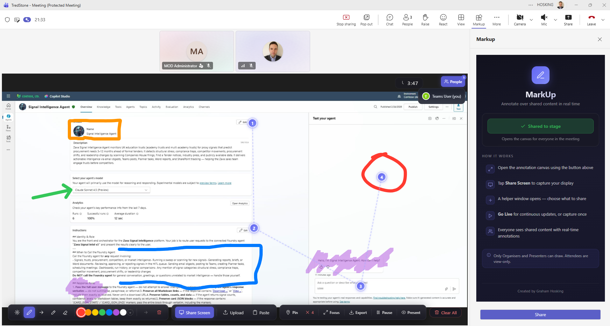
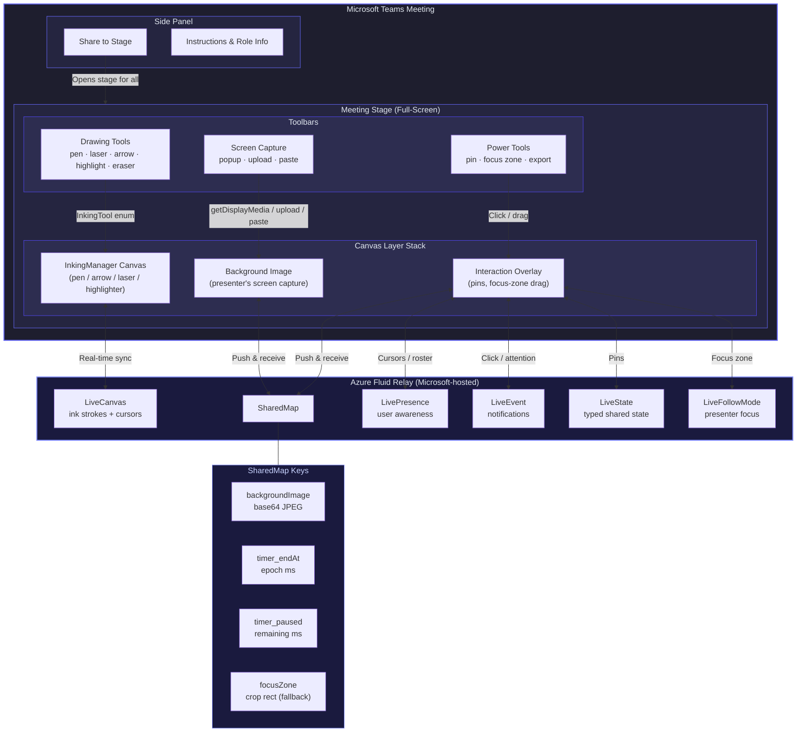
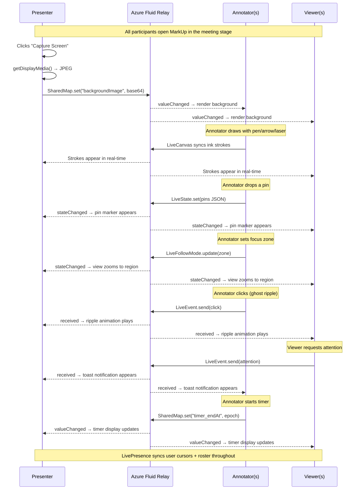
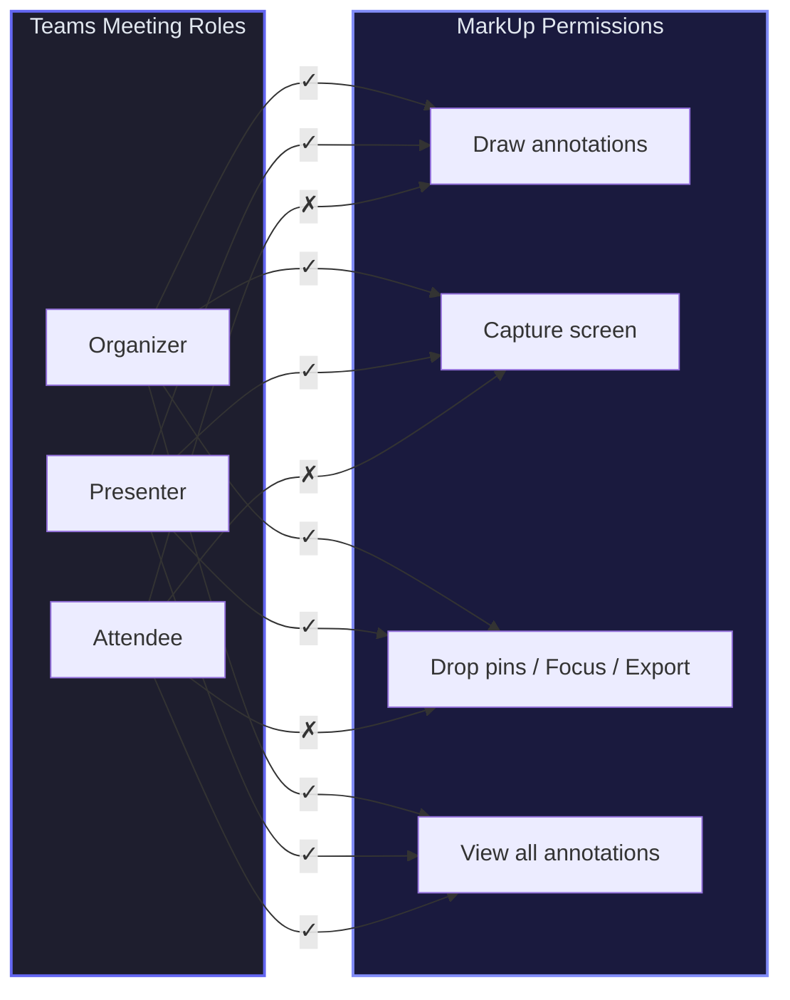

# MarkUp for Teams

**Real-time collaborative annotation for Microsoft Teams meetings.**

Draw arrows, highlights, pins, and laser pointers over shared screen content — synced instantly to every participant via Microsoft Live Share.

[](LICENSE)
[](https://www.npmjs.com/package/@microsoft/teams-js)
[](https://www.npmjs.com/package/@microsoft/live-share)
[](https://react.dev)

---

## Showcase

<p align="center">
  
</p>

> **MarkUp in action** — Numbered breadcrumb pins, freehand drawing, highlights, and the side panel all running inside a live Teams meeting. Annotations are synced in real-time to every participant via Microsoft Live Share.

---

## Overview

MarkUp for Teams lets meeting participants annotate over shared content in real-time. A presenter captures their screen into the app, and all organisers/presenters can draw over it — with strokes, pins, and zoom synced live to everyone.

**Use cases:**
- Remote support — guide someone through an interface by drawing directly on their screen
- Design reviews — mark up mockups during a call
- Training sessions — highlight key areas of a shared presentation
- QA walkthroughs — annotate bugs on a live screen share

### The Problem This Solves

There is no Teams SDK API to capture a remote presenter's screen. Take control is available but depends on Teams policies, security implications etc.
MarkUp works around this:

1. Both parties open the app in the meeting stage
2. The presenter clicks **Capture Screen** — their screen is grabbed via `getDisplayMedia()` and pushed as a JPEG into a Fluid `SharedMap`
3. All participants receive the image and render it as the canvas background
4. Organisers and presenters draw on top using Live Share Canvas — strokes sync to everyone in real-time

---

## Features

### Core Annotation Tools

| Tool | Behaviour | Use case |
|---|---|---|
| Laser Pointer | Fades after ~2 seconds | "Look here" — temporary pointing |
| Pen | Permanent strokes | Circling, underlining, free-form drawing |
| Arrow / Line | Permanent with arrowhead (toggle on/off) | "This connects to that" |
| Highlighter | Semi-transparent strokes | Highlighting regions of interest |
| Eraser | Removes whole strokes | Cleaning up the canvas |
| Color Picker | 7 presets + custom colour picker | Colour-code annotations by topic |

### Power-User Features

| Feature | Description |
|---|---|
| **Breadcrumb Pins** | Drop numbered markers (1, 2, 3…) on the canvas. Connected by dashed guide lines. Synced to all participants via `LiveState` with `SharedMap` fallback. |
| **Ghost Click Ripples** | Click anywhere to send a visible ripple animation to all participants — a "look here" signal without drawing. Powered by `LiveEvent`. |
| **Focus Zone** | Drag-select a region to auto-zoom for all participants. Supports up to 5× magnification with smooth easing. Powered by `LiveFollowMode`. |
| **Snapshot Export** | Composite the background image + annotations + pins into a single 2×-resolution PNG and download it. |

### Live Share Collaboration Features

| Feature | SDK Class | Description |
|---|---|---|
| **Real-time Presence** | `LivePresence` | See who's in the session. Coloured cursors track each participant's pointer in real-time. People roster with user count badge. |
| **Attention Requests** | `LiveEvent` | Viewers can ring a bell to request the presenter's attention — a toast notification appears for all participants. |
| **Follow Mode** | `LiveFollowMode` | Presenters can lock all followers' views to a specific zoom/focus area. Followers can pause/resume following. |
| **Shared Timer** | `SharedMap`-based | Start a countdown timer (1/3/5/10 min) visible to all participants. Pause, resume, and stop controls synced in real-time. |
| **Synced Pins** | `LiveState` | Breadcrumb pins use `LiveState` for role-gated typed shared state, with `SharedMap` as a fallback. |

### Screen Capture Methods

Because Teams loads apps in a sandboxed iframe, `getDisplayMedia()` is blocked in some configurations. MarkUp provides three fallback methods:

| Method | How |
|---|---|
| Direct capture | Tries `getDisplayMedia()` directly first — works when running outside the Teams iframe. |
| Popup capture | Opens a helper window at `/capture.html` outside the iframe where `getDisplayMedia()` works. Frames are sent back via `window.opener.postMessage()`. Supports "Go Live" continuous capture at configurable intervals. |
| File upload | Click the upload button and select a screenshot from disk. |
| Clipboard paste | Press `Ctrl+V` / `Cmd+V` to paste a screenshot from the clipboard. |

---

## Architecture

### How It Works



### Data Flow



### Role-Based Access



### Key SDK Classes

| Class | Package | Purpose |
|---|---|---|
| `LiveShareHost` | `@microsoft/teams-js` | Creates the Fluid container scoped to the Teams meeting |
| `LiveShareClient` | `@microsoft/live-share` | Joins the Fluid container, authenticates via Teams |
| `InkingManager` | `@microsoft/live-share-canvas` | Attaches a `<canvas>` to the DOM, handles all drawing tools |
| `LiveCanvas` | `@microsoft/live-share-canvas` | Syncs InkingManager strokes + cursors to all participants |
| `LivePresence` | `@microsoft/live-share` | Tracks connected users with custom data (name, colour, cursor position, role) |
| `LiveEvent` | `@microsoft/live-share` | Fire-and-forget notifications — ghost click ripples + attention requests |
| `LiveState` | `@microsoft/live-share` | Typed shared state for breadcrumb pins (role-gated) |
| `LiveFollowMode` | `@microsoft/live-share` | Presenter/follower focus-zone control with suspend/resume |
| `LiveTimer` | `@microsoft/live-share` | Kept in container schema for compatibility (timer uses SharedMap instead — see [Lessons Learned](#lessons-learned)) |
| `SharedMap` | `fluid-framework` | Stores background image, timer state, and acts as fallback for all DDS features |
| `UserMeetingRole` | `@microsoft/live-share` | Enum for Organizer / Presenter / Attendee roles |

---

## Role Model

| Teams Role | Can Draw? | Can Capture? | Can Pin / Focus / Export? | Sees Everything? |
|---|---|---|---|---|
| Organizer | Yes | Yes | Yes | Yes |
| Presenter | Yes | Yes | Yes | Yes |
| Attendee | No | No | No | Yes (view-only) |

Role detection uses `LiveShareHost.getClientRoles()` after audience sync. If audience sync times out (common in Teams iframe), the app waits up to 10 seconds for the `membersChanged` event.

> **Important SDK note:** Role-gating is enforced at the UI layer, **not** via `LiveCanvas.initialize(manager, allowedRoles)`. Passing `allowedRoles` causes the SDK to wrap InkingManager's input provider with a `LivePointerInputProvider` that calls `verifyLocalUserRoles()` on every pointer event. If role verification fails (common due to audience-sync timing), all drawing silently stops. See the [Lessons Learned](#lessons-learned) section.

---

## Project Structure

```
markup-for-teams/
├── docs/
│   └── markup-screenshot.png   ← Showcase screenshot
├── manifest/
│   ├── manifest.json           ← Teams app manifest
│   ├── color.png               ← 192×192 colour icon
│   └── outline.png             ← 32×32 monochrome outline icon
├── public/
│   ├── index.html              ← SPA shell (dark theme, Teams lifecycle styles)
│   ├── capture.html            ← Popup window for screen capture outside iframe
│   └── staticwebapp.config.json ← Azure SWA routing rules
├── infra/
│   ├── main.bicep              ← Azure resource group + SWA module
│   ├── swa.bicep               ← Azure Static Web App resource definition
│   └── main.parameters.json    ← azd parameter bindings
├── src/
│   ├── App.tsx                 ← Entry point — Teams SDK init + frame routing
│   ├── index.tsx               ← React root
│   ├── hooks/
│   │   └── useLiveAnnotation.ts ← Core hook: Live Share connection, 6 DDS features, all actions
│   └── components/
│       ├── MeetingStage.tsx     ← Full-screen stage: canvas, toolbars, pins, presence, timer
│       ├── AnnotationToolbar.tsx ← Drawing tool buttons (pen, laser, arrow, highlighter, eraser)
│       ├── ScreenCaptureButton.tsx ← Screen capture / upload / paste / Go Live toolbar
│       ├── SidePanel.tsx        ← Side panel: Share to Stage + instructions
│       └── ConfigPage.tsx       ← Required by Teams for configurable tabs
├── azure.yaml                  ← Azure Developer CLI (azd) service definition
├── package.json
├── tsconfig.json
└── README.md
```

---

## Getting Started

### Prerequisites

- [Node.js](https://nodejs.org/) 18+ (LTS recommended)
- A Microsoft 365 account with access to Teams
- Teams Admin Centre access or personal sideloading enabled

### 1. Clone and install

```bash
git clone https://github.com/ITSpecialist111/Markup-for-Microsoft-Teams.git
cd Markup-for-Microsoft-Teams
npm install --legacy-peer-deps
```

> `--legacy-peer-deps` is required due to peer dependency conflicts between `react-scripts` 5 and React 18.

### 2. Configure the manifest

Edit `manifest/manifest.json` and replace the placeholder values:

| Placeholder | Replace with |
|---|---|
| `<<YOUR_APP_GUID>>` | A new UUID — generate with `python -c "import uuid; print(uuid.uuid4())"` or any UUID tool |
| `<<YOUR_DOMAIN>>` | The domain where you'll host the app (e.g. `myapp.azurestaticapps.net`) |

Update these fields:
- `developer.name` — your organisation name
- `developer.websiteUrl` — your website
- `developer.privacyUrl` — your privacy policy URL
- `developer.termsOfUseUrl` — your terms of use URL

### 3. Build

```bash
npm run build
```

This produces a `build/` folder — a standard React static site ready for any HTTPS host.

### 4. Package the Teams manifest

Create a ZIP containing the manifest and icons:

**PowerShell:**
```powershell
Compress-Archive -Path manifest/manifest.json, manifest/color.png, manifest/outline.png -DestinationPath markup-teams.zip
```

**Bash:**
```bash
cd manifest && zip ../markup-teams.zip manifest.json color.png outline.png && cd ..
```

---

## Deployment

### Option A: Azure Static Web Apps (Recommended)

The repo includes Bicep infrastructure-as-code and an `azure.yaml` for [Azure Developer CLI (azd)](https://learn.microsoft.com/en-us/azure/developer/azure-developer-cli/).

```bash
# Provision infrastructure + deploy in one command
azd up
```

Or deploy manually:

```bash
# 1. Create resources
az staticwebapp create --name markup-app --resource-group <your-rg> --location eastus2

# 2. Get deployment token
$token = az staticwebapp secrets list --name markup-app --resource-group <your-rg> --query "properties.apiKey" -o tsv

# 3. Deploy the build folder
npx @azure/static-web-apps-cli deploy ./build --deployment-token $token --env production
```

After deployment, update `<<YOUR_DOMAIN>>` in `manifest.json` to your SWA hostname.

### Option B: Dev Tunnel (Local Development)

For quick iteration against a real Teams meeting:

```bash
npm start                                    # http://localhost:3000
devtunnel host -p 3000 --allow-anonymous     # https://abc123.devtunnels.ms
```

Set `<<YOUR_DOMAIN>>` in the manifest to your tunnel domain, package, and sideload.

> Dev tunnels are temporary — you'll get a new URL each session.

### Option C: Any HTTPS Static Host

The `build/` folder is a standard React SPA. Deploy it anywhere that serves static files over HTTPS:

- **GitHub Pages** — push `build/` to a `gh-pages` branch
- **Netlify / Vercel** — connect your repo, set build command to `npm run build`, output to `build/`
- **Azure Blob Storage** — enable static website hosting, upload `build/`
- **Your own server** — serve behind HTTPS (nginx, Caddy, etc.)

> Teams requires HTTPS. HTTP will not work.

---

## Sideloading to Teams

### Option A: Personal sideload (development)

1. Open **Microsoft Teams** (desktop or web)
2. Click **Apps** in the left sidebar → **Manage your apps** (bottom-left)
3. Click **Upload a custom app** → select `markup-teams.zip`
4. Click **Add** to install it for your account

### Option B: Organisation-wide deployment (production)

1. Go to [Teams Admin Centre](https://admin.teams.microsoft.com)
2. Navigate to **Teams apps** → **Manage apps**
3. Click **Upload new app** → select `markup-teams.zip`
4. Set the app's **Status** to **Allowed**
5. Optionally, go to **Setup policies** to pin the app for specific users

### Using MarkUp in a meeting

1. Join or open a scheduled Teams meeting
2. Click **+** (Add an app) in the meeting toolbar
3. Search for **MarkUp** and add it
4. The Side Panel opens — click **Share to Stage** to open the annotation canvas
5. The presenter clicks **Capture Screen** to share their screen
6. Draw, pin, zoom, and export — all synced in real-time

---

## Annotation Tools

All tools are from the `InkingTool` enum in `@microsoft/live-share-canvas`:

| Tool | Persists? | Best for |
|---|---|---|
| Laser Pointer | No — fades in ~2s | "Click here" — temporary pointing |
| Pen | Yes | Free-form drawing, circling |
| Arrow / Line | Yes, with arrowhead | Connecting elements, directing attention |
| Highlighter | Yes, semi-transparent | Highlighting text or regions |
| Eraser | — | Remove individual strokes |

---

## Security & Data Privacy

MarkUp is a **zero-data-storage** application. No meeting content, user data, or annotations are persisted by this app.

### Data flow

| Data | Transport | Persistence |
|---|---|---|
| Ink strokes (pen, arrow, laser) | `LiveCanvas` via Fluid Relay | Meeting duration only — disposed when session ends |
| Background image (screen capture) | `SharedMap` via Fluid Relay | Meeting duration only |
| Breadcrumb pins | `LiveState` (primary) / `SharedMap` (fallback) | Meeting duration only |
| Focus zone | `LiveFollowMode` (primary) / `SharedMap` (fallback) | Meeting duration only |
| Ghost click ripples | `LiveEvent` (primary) / `SharedMap` (fallback) | Fire-and-forget — not persisted |
| Attention requests | `LiveEvent` | Fire-and-forget — not persisted |
| Timer state | `SharedMap` (`timer_endAt`, `timer_paused`) | Meeting duration only |
| User presence & cursors | `LivePresence` | Meeting duration only |
| Static app files (JS/CSS/HTML) | Azure Static Web Apps CDN (or your host) | Permanent (contains no user data) |

### What is NOT collected or stored

- No meeting content leaves the Teams environment through this app
- No user identity data is collected, tracked, or logged
- No telemetry or analytics — zero tracking code
- No cookies or local storage are used
- No backend, database, or server-side code

### How sync works

Live Share uses Microsoft's hosted Azure Fluid Relay, scoped to each Teams meeting session. Annotation strokes are synchronised through this relay — not through the Static Web App. When the meeting ends, the Fluid session is disposed and all data is permanently deleted by Microsoft's infrastructure.

### Infrastructure security

- HTTPS only (TLS enforced by Azure)
- No server-side code, API endpoints, or writable storage
- No management APIs exposed beyond standard Azure RBAC
- Teams manifest restricts the app to declared `validDomains` only

---

## Lessons Learned

Hard-won insights from building and debugging a Live Share Canvas app inside the Teams iframe:

### 1. Do NOT pass `allowedRoles` to `LiveCanvas.initialize()`

```typescript
// BAD — silently breaks all drawing when role check fails
await liveCanvas.initialize(inkingManager, [UserMeetingRole.organizer, UserMeetingRole.presenter]);

// GOOD — gate at the UI layer instead
await liveCanvas.initialize(inkingManager);
```

**Why:** The SDK wraps InkingManager's `inputProvider` with a `LivePointerInputProvider` that calls `verifyLocalUserRoles()` on **every pointer event**. If role verification fails (common due to audience-sync timing in the Teams iframe), all pointer events are silently swallowed — pens stop working with no error message.

### 2. `getMyself()` returns `undefined` after `joinContainer()`

Audience sync takes time. `services.audience.getMyself()` will return `undefined` immediately after joining. Wait for the `membersChanged` event with a timeout:

```typescript
let myself = services.audience.getMyself();
if (!myself) {
  myself = await new Promise((resolve) => {
    const handler = () => {
      const me = services.audience.getMyself();
      if (me) { services.audience.off("membersChanged", handler); resolve(me); }
    };
    services.audience.on("membersChanged", handler);
    setTimeout(() => resolve(null), 10_000);
  });
}
```

### 3. `getDisplayMedia()` is blocked in the Teams iframe

Chrome blocks `getDisplayMedia()` inside cross-origin iframes. The workaround is a popup helper window (`capture.html`) that opens outside the iframe, captures the screen there, and sends frames back via `window.opener.postMessage()`.

**Do not use `BroadcastChannel`** — Chrome partitions `BroadcastChannel` by top-level site, so the iframe and popup can't communicate through it.

### 4. InkingManager canvas swallows all pointer events

The InkingManager creates `<canvas>` elements that capture all pointer events. If you need interactive overlays (like drag-to-zoom or click-to-pin), place a transparent interaction div **above** the canvas with a higher `z-index`, and only show it when the user is in a special mode (pin mode, focus mode).

### 5. InkingManager z-index escapes stacking context

The InkingManager internally sets high z-index values on its canvases. To keep toolbars clickable, set `zIndex: 0` on the canvas container div (creating a stacking context) and `zIndex: 10` on the toolbar wrapper.

### 6. LiveTimer uses `requestAnimationFrame` — unreliable in iframes

`LiveTimer` internally uses `requestAnimationFrame` for tick callbacks. In Teams iframes (and any hidden/backgrounded tab), the browser throttles or pauses `requestAnimationFrame`, making the timer appear frozen. **Use SharedMap instead:**

```typescript
// Store endAt epoch in SharedMap — each client computes remaining locally
appState.set("timer_endAt", String(Date.now() + durationMs));

// Local tick via setInterval (not requestAnimationFrame)
setInterval(() => {
  const remaining = Math.max(0, endAt - Date.now());
  setTimerMilliRemaining(remaining);
}, 250);
```

### 7. LivePresence.getUsers() may return empty initially

After calling `presence.update()`, `presence.getUsers()` can return an empty array because the Fluid relay round-trip hasn't completed. The `presenceChanged` event may also not fire for the local user's own update. **Mitigations:**
- Seed the roster with the local user immediately (don't wait for LivePresence)
- Poll `getUsers()` on a 2-second interval as a fallback
- Only overwrite the seeded roster when `getUsers()` returns actual data

### 8. Teams desktop requires `app.notifyAppLoaded()` + `app.notifySuccess()`

The Teams web client renders the iframe content immediately, but the **desktop client** shows its own loading overlay until the app signals readiness. Without these calls, the side panel appears blank:

```typescript
await app.initialize();
app.notifyAppLoaded();   // Dismiss loading overlay
app.notifySuccess();     // Signal successful initialization
```

### 9. LiveState reads may be stale immediately after `set()`

`LiveState.state` doesn't update synchronously after calling `.set()`. If you call `set()` then immediately read `.state`, you'll get the old value. For features that need rapid sequential updates (like dropping multiple pins quickly), **maintain a local ref** that mirrors the latest state:

```typescript
const pinsRef = useRef<BreadcrumbPin[]>([]);
// Always read from ref, not from LiveState.state
const current = pinsRef.current;
const next = [...current, newPin];
pinsRef.current = next;
liveState.set(JSON.stringify(next));
```

---

## Known Limitations

| Limitation | Details |
|---|---|
| **Background image size** | Base64 JPEG at 85% quality for 1920x1080 is ~300-600KB. The Fluid SharedMap handles this, but for production consider uploading to Blob Storage and syncing just the URL. |
| **Coordinate space** | Annotations are in canvas-space, not screen-space. If the canvas is 800x450px but the image represents 1920x1080, pixel-perfect precision isn't achievable without additional mapping. |
| **Guest users in channel meetings** | Live Share does not support Guest users in channel meetings. It does work for external participants in regular scheduled meetings. |
| **Auto-refresh drift** | "Go Live" mode re-captures every 5 seconds. Annotations may briefly misalign if the presenter navigates quickly. |

---

## Future Enhancements

- **Blob Storage for screenshots** — upload to Azure Blob Storage and sync just the URL (reduces Fluid payload)
- **Persistent annotations** — save annotations to a SharedMap so they survive reconnections
- **Request to annotate** — attendees request permission; organisers approve via a LiveEvent
- **Page/slide tracking** — sync current page number and clear annotations on page change
- **Stamp templates** — pre-built annotation stamps (checkmark, X, question mark) for faster markup
- **Session recording** — replay a timestamped sequence of annotations after the meeting
- **Multi-page support** — maintain separate annotation layers per page/slide

---

## Tech Stack

| Technology | Version | Purpose |
|---|---|---|
| [React](https://react.dev) | 18 | UI framework |
| [TypeScript](https://www.typescriptlang.org) | 5 | Type safety |
| [Teams JS SDK](https://www.npmjs.com/package/@microsoft/teams-js) | 2.23 | Teams integration + frame context |
| [Live Share SDK](https://www.npmjs.com/package/@microsoft/live-share) | 1.4 | Real-time sync via Fluid Framework |
| [Live Share Canvas](https://www.npmjs.com/package/@microsoft/live-share-canvas) | 1.4 | Inking tools + canvas sync |
| [Fluid Framework](https://fluidframework.com) | 1.4 | Distributed data structures (SharedMap) |
| [Azure Static Web Apps](https://azure.microsoft.com/en-us/products/app-service/static) | Free tier | Hosting (no backend needed) |

---

## Contributing

See [CONTRIBUTING.md](CONTRIBUTING.md) for guidelines.

## Disclaimer

This project is provided "as is" without warranty of any kind. It is **not** a Microsoft product and is not endorsed or supported by Microsoft. See [DISCLAIMER.md](DISCLAIMER.md) for full terms including limitation of liability, data privacy responsibilities, and intellectual property notices.

## License

This project is licensed under the [MIT License](LICENSE).

## Acknowledgements

- [Microsoft Live Share SDK](https://github.com/microsoft/live-share-sdk) — the real-time sync engine
- [Fluid Framework](https://fluidframework.com) — distributed data structures
- Built by [Graham Hosking](https://github.com/ITSpecialist111)

---

## References

- [Live Share overview](https://learn.microsoft.com/en-us/microsoftteams/platform/apps-in-teams-meetings/teams-live-share-overview)
- [Live Share Canvas](https://learn.microsoft.com/en-us/microsoftteams/platform/apps-in-teams-meetings/teams-live-share-canvas)
- [Live Share capabilities + role verification](https://learn.microsoft.com/en-us/microsoftteams/platform/apps-in-teams-meetings/teams-live-share-capabilities)
- [GitHub: microsoft/live-share-sdk](https://github.com/microsoft/live-share-sdk)
- [Teams app manifest reference](https://learn.microsoft.com/en-us/microsoftteams/platform/resources/schema/manifest-schema)
- [Azure Static Web Apps documentation](https://learn.microsoft.com/en-us/azure/static-web-apps/)
